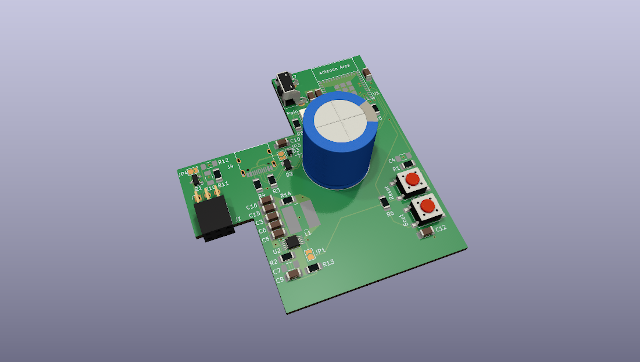

# ZK-meter

ZK-meter is a Zigbee HAN-module for Kamstrup Omnipower electricity meters.

## Features

 * No external power supply needed
 * Fits inside Kamstrump HAN-module casing
 * Supports Zigbee 3.0

## Getting started

### Assembly

1. Open the HAN-Module casing:
    * Use a small screwdriver to release the two clips located on both sides of the HAN-module casing.
    * Gently pull the top cover off to expose the interior.

1. Replace the PCB:
    * Remove the original PCB from its position.
    * Insert the ZK-meter PCB in the same location. Ensure that it fits precisely as the original PCB did.

1. Secure the Top Cover:
    * Place the top cover back onto the HAN-module casing.
    * Press down to secure the top cover in place.

### Installation

1. Insert the HAN-Module:
    * Identify the HAN-port on your meter. It is typically positioned above the display.
    * Carefully insert the HAN-module into the HAN-port.
    * Wait for the LED next to the pairing button to illuminate.

1. Activate Pairing Mode:
    * Press and hold the pairing button on the HAN-module.
    * Keep holding until the LED flashes, indicating that the device is now in pairing mode.

## Troubleshooting

## Development
